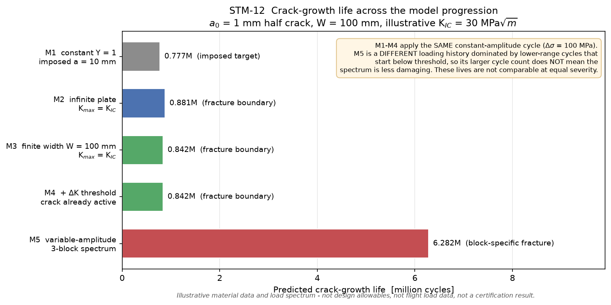
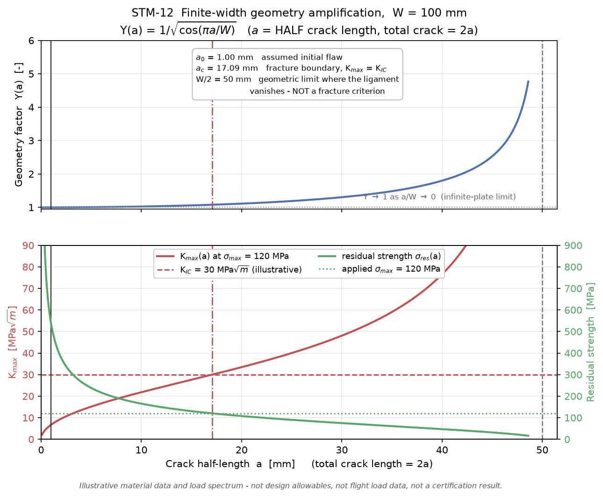
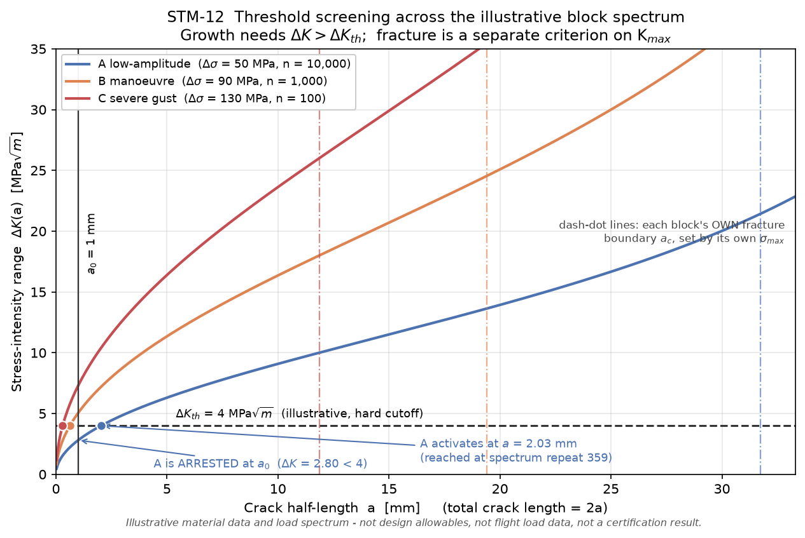
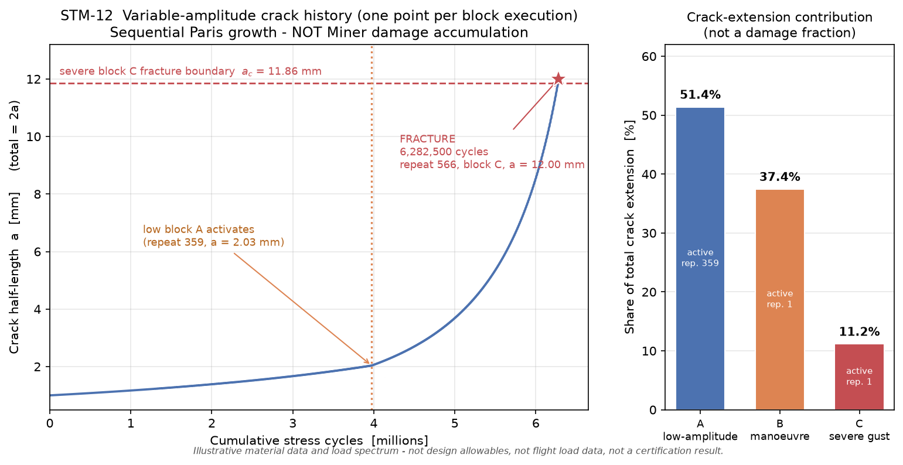

# STM-12 — Wing-Skin Crack Growth (Paris Law)

A verified, deterministic **linear-elastic fracture mechanics (LEFM)** and
**Paris-law** fatigue-crack-growth analysis for an idealized aircraft wing-skin
crack, built up in five independently verified stages and finished with an
integrated assessment.

Pure Python, **no runtime dependencies**, **1213 automated tests**.

## Objective

> How do finite-width geometry amplification, fracture toughness, crack-growth
> threshold, initial flaw size, and ordered variable-amplitude loading interact
> to determine remaining crack-growth life in an idealized wing skin?

## Key result

Canonical case: centre through crack, half-length `a₀` = 1 mm in a `W` = 100 mm
panel; illustrative `K_IC` = 30 MPa·√m, `ΔK_th` = 4 MPa·√m, Paris `m` = 3.

| Model stage | Geometry | Loading | End condition | Life |
| --- | --- | --- | --- | ---: |
| M1 constant `Y` | `Y` = 1 | constant amplitude | imposed `a` = 10 mm | 0.777 M cycles |
| M2 fracture boundary | `Y` = 1 | constant amplitude | `K_max` = `K_IC` at 19.894 mm | 0.881 M |
| M3 finite width | `Y(a)`, W = 100 mm | constant amplitude | `K_max` = `K_IC` at 17.094 mm | 0.842 M |
| M4 `ΔK` threshold | `Y(a)`, W = 100 mm | constant amplitude | crack already active | 0.842 M (identical) |
| M5 spectrum | `Y(a)`, W = 100 mm | 3-block variable amplitude | block-specific fracture | **6.283 M actual cycles** |

> **Read the last row carefully.** The M5 cycle count is larger, but that does
> **not** mean the spectrum is less damaging in any universal sense. M1–M4 all
> apply the *same* constant-amplitude cycle (`Δσ` = 100 MPa). M5 is a *different*
> loading history dominated by lower-range cycles, most of which start below the
> threshold. These lives are not comparable at equal severity.



**Headline findings**

- **Finite width** cuts the critical crack size by **14.1 %** and the
  constant-amplitude life by **4.4 %**.
- The **hard `ΔK` threshold is binary**: an active crack grows at exactly the
  unmodified Paris rate; an arrested crack does not propagate at all.
- Under the spectrum the **low-amplitude block starts arrested**, activates at
  repeat 359, and then contributes **51.4 %** of the total crack extension.
- The **severe block owns the smallest fracture boundary** (11.86 mm) and
  triggers fracture — on its *first cycle* of the final pass.
- **Sequence effects** arise only from evolving crack size and threshold/fracture
  logic. There is no overload retardation or any other load-history memory.
- Cycle-to-fracture differences below **one spectrum (0.177 % of life)** are
  block quantisation, not physics.

## Engineering workflow

```
constant-Y Paris growth              (M1)  analytical + numerical life
  -> toughness-derived critical size (M2)  K_max = K_IC, residual strength
  -> finite-width Y(a)               (M3)  secant correction, log-grid integration
  -> ΔK-threshold screening          (M4)  hard cutoff, active/arrested states
  -> ordered block-spectrum growth   (M5)  sequential, per-block boundaries
  -> integrated assessment           (M6)  this repository
```

## Crack and unit conventions

All internal computation is SI. Engineering units appear only in output.

| Quantity | Symbol | Unit |
| --- | --- | --- |
| Crack **half**-length | `a` | m |
| Total crack length | `2a` | m |
| Stress | `σ` | Pa (tension positive) |
| Stress intensity | `K`, `ΔK` | Pa·√m |
| Paris coefficient | `C` | m/cycle / (Pa·√m)^m |
| Crack-growth rate | `da/dN` | m/cycle |
| Life | `N` | cycles |

**`a` is always the HALF crack length.** A centre crack of half-length `a` in a
panel of width `W` has total length `2a`, remaining ligament `W − 2a`, ligament
fraction `1 − 2a/W`, and is admissible only while `0 < 2a < W`. Confusing `a`
with `2a` is the easiest damaging error in this subject, so the convention is
enforced at every boundary and locked by dedicated tests.

Tensile stress is positive, compression negative; `Δσ = σ_max − σ_min`,
`σ_m = (σ_max + σ_min)/2`, `σ_a = Δσ/2`, `R = σ_min/σ_max`.

## Governing equations

**Stress intensity** — signed, so compression stays negative:

```
K(a)  = Y(a) · σ        · sqrt(π·a)
ΔK(a) = Y(a) · Δσ       · sqrt(π·a)      growth driving force
K_max(a) = Y(a) · σ_max · sqrt(π·a)      fracture driving force
```

**`ΔK` and `K_max` are never interchanged.** Growth is driven by the *range*;
fracture by the *maximum*. At fixed `Δσ`, changing `σ_max` leaves the Paris
growth rate at any crack size completely unchanged while moving the fracture
boundary — verified to 12 significant figures.

**Paris law** (above threshold):

```
da/dN = C · (ΔK)^m
```

`C` is stored on the SI (Pa·√m) basis. Handbook values are quoted on the MPa·√m
basis, and the conversion is a named, tested function — never inferred:

```
C_SI = C_MPa / (10⁶)^m          →  1.0×10⁻¹¹ / 10¹⁸ = 1.0×10⁻²⁹  at m = 3
```

Mixing the two bases is an error of 10¹⁸ here, so it is guarded by test.

**Fracture boundary and residual strength:**

```
K_max(a_c) = K_IC        σ_res(a) = K_IC / (Y(a)·sqrt(π·a))
```

Both are the same equation solved two ways: `σ_res(a_c) = σ_max` exactly.
A useful invariant that survives any geometry, because `Y(a_c)` cancels:

```
ΔK(a_c) / K_IC = Δσ / σ_max          (= 5/6 for the canonical cycle)
```

**Threshold** — a deliberately simple hard cutoff:

```
ΔK ≤ ΔK_th  →  da/dN = 0            (equality arrests)
ΔK >  ΔK_th  →  da/dN = C·(ΔK)^m     (the UNMODIFIED Paris rate)
```

No `C·(ΔK − ΔK_th)^m` law, no closure correction, no near-threshold roll-off.

## Finite-width geometry

The standard secant correction for a centre-cracked panel:

```
Y(a, W) = 1 / sqrt(cos(π·a/W))
```

`Y → 1` as `a/W → 0`; `Y` rises monotonically; `Y → ∞` as `a → W/2`, where the
ligament vanishes. With `Y = Y(a)` the closed-form critical size no longer
exists, so `K_max(a_c) = K_IC` is solved by bounded bisection — deterministic,
bracket-safe, exposed tolerance, and never evaluated at `W/2`.



A consequence worth noting: the exact infinite-plate scaling `a_c ∝ K_IC²`
**breaks** under finite width. Tripling `K_IC` from 20 to 60 MPa·√m would
enlarge `a_c` ninefold in an infinite plate; here it enlarges it only 4.1-fold,
because a larger `a_c` sits at a higher `Y(a_c)`.

## Variable-amplitude spectrum

An ordered sequence of constant-amplitude blocks, repeated until fracture.

| Block | `σ_max` | `Δσ` | Count | `ΔK(a₀)` | State at `a₀` | `a_th` | `a_c` |
| --- | ---: | ---: | ---: | ---: | --- | ---: | ---: |
| A low-amplitude | 70 MPa | 50 MPa | 10 000 | 2.803 | **ARRESTED** | 2.033 mm | 31.736 mm |
| B manoeuvre | 110 MPa | 90 MPa | 1 000 | 5.046 | ACTIVE | 0.629 mm | 19.409 mm |
| C severe gust | 150 MPa | 130 MPa | 100 | 7.288 | ACTIVE | 0.301 mm | **11.859 mm** |

11 100 cycles per spectrum. Each block carries its **own** threshold size (from
its `Δσ`) and its **own** fracture boundary (from its `σ_max`) — never a
spectrum-wide average.



### This is not Miner's rule

**No cumulative-damage sum `D = Σ nᵢ/Nᵢ` is formed anywhere**, and no life is
derived from one. A damage sum would discard exactly the state that governs the
answer: after every block the crack length has changed, and with it `Y(a)`,
`ΔK(a)`, the threshold verdict and the fracture boundary. The sequential Paris
process is integrated directly, carrying the crack length forward.

The canonical result shows why it matters: block A runs **100× more cycles**
than block C but produces only **4.6×** the crack extension. Cycle counts do not
rank blocks.

Block advancement **inverts** the verified life integral —
`N(a_start → a_end) = n_block`, solved by bounded bisection — rather than taking
a crude `a + n·(da/dN)` step that would freeze the rate across a block.

## Canonical integrated result

| Result | Value |
| --- | ---: |
| Status | `FRACTURE_REACHED` |
| Full spectra completed | 565 |
| Partial spectrum | 11 000 cycles |
| **Total cycles** | **6 282 500** |
| Final crack half-length | 12.003 mm |
| Fracture block | C severe gust (repeat 566) |
| Cycle within that block | **0.000** of 100 |
| `K_max`/`K_IC` at detection | 1.00696 |

**Fracture occurs as the severe block begins.** The two milder blocks pushed the
crack past C's 11.86 mm boundary earlier in the *same* pass without fracturing —
their own boundaries are 19.4 and 31.7 mm — so C fractures on its first cycle.
This is precisely why fracture must be checked per block, in sequence, rather
than against a single envelope.



### Crack-extension contribution by block

Not a damage fraction.

| Block | Cycles | Extension | Share | First active | Triggered fracture |
| --- | ---: | ---: | ---: | --- | --- |
| A low-amplitude | 5 660 000 | 5.655 mm | **51.4 %** | repeat 359 | no |
| B manoeuvre | 566 000 | 4.120 mm | 37.5 % | repeat 1 | no |
| C severe gust | 56 500 | 1.228 mm | 11.2 % | repeat 1 | **yes** |

A block cannot be dismissed from its state at `a₀`: the threshold verdict is
recomputed on every execution, and the block that started arrested ends up
dominant.

### Sequence order

Compared by crack length after a fixed number of spectra, which removes the
block-granularity quantisation a cycles-to-fracture comparison carries.

| Order | `a` @200 repeats | `a` @400 repeats | Cycles to fracture |
| --- | ---: | ---: | ---: |
| A→B→C | 1.441960007 mm | 2.610895717 mm | 6 282 500 |
| C→B→A | 1.441960014 mm | 2.620253809 mm | 6 271 500 |
| B→C→A | 1.441960007 mm | 2.620253790 mm | 6 272 500 |

Before the low block activates the orderings agree to **1 part in 10⁸** — the
model is effectively order-independent, as pure Paris growth over always-active
blocks should be. After activation a real but small **0.36 %** effect appears:
running the low block first catches it at the smallest crack of each pass, where
it is most often still arrested.

Measured on cycles to fracture instead, the spread (0.175–0.177 %) is one
spectrum — the quantisation floor. **No numerical significance is claimed below
that floor.**

## Robustness

| `ΔK_th` [MPa·√m] | Active at `a₀` | Cycles | Status |
| ---: | :---: | ---: | --- |
| disabled / 2.0 | 3/3 | 4 018 100 | `FRACTURE_REACHED` |
| 4.0 | 2/3 | 6 271 400 | `FRACTURE_REACHED` |
| 6.0 | 1/3 | 15 007 100 | `FRACTURE_REACHED` |
| 8.0 | 0/3 | ∞ | `SPECTRUM_ARRESTED` |

| `a₀` [mm] | Active at `a₀` | Cycles | Status |
| ---: | :---: | ---: | --- |
| 0.25 | 0/3 | ∞ | `SPECTRUM_ARRESTED` |
| 0.50 | 1/3 | 18 514 700 | `FRACTURE_REACHED` |
| 1.00 | 2/3 | 6 271 400 | `FRACTURE_REACHED` |
| 4.00 | 3/3 | 1 165 400 | `FRACTURE_REACHED` |

| Severe-block count | Cycles | Fracture block |
| ---: | ---: | --- |
| 0 (removed) | 7 985 415 | **B manoeuvre** |
| 100 | 6 271 400 | C severe gust |
| 200 | 5 364 600 | C severe gust |

Removing the severe block hands fracture governance to the manoeuvre block, whose
boundary is 19.4 mm rather than 11.9 mm.

Also verified: disabling the threshold **shortens** predicted life by 36 %;
stress scaling 0.75 → 1.25 shortens life monotonically (24.3 M → 2.36 M cycles);
toughness 20 → 50 MPa·√m lengthens it with diminishing returns (5.55 M → 6.68 M);
width 50 → 500 mm lengthens it and converges (6.01 M → 6.39 M). Threshold
activity is independent of `K_IC`, since `K_IC` does not enter `ΔK`.

An "arrested" result means only that the modelled `ΔK` never exceeds the assumed
constant threshold under this exact loading. It is **not** infinite structural
life.

## Verification

**1213 automated tests**, no runtime dependencies. Verification rests on
independent legs rather than self-consistency:

- **Hand calculations** with literal expected values: `K`, `ΔK`, `R`, `da/dN`,
  the Paris `C` unit conversion, `Y(a)`, and the closed-form life on both the
  `m ≠ 2` and `m = 2` branches.
- **Analytical vs numerical life** for constant `Y`, cross-checked over a
  360-case sweep to 10⁻⁸ relative; neither routine calls the other.
- **Scaling laws**: `K ∝ σ`, `K ∝ √a`, `ΔK ∝ Δσ`, `ΔK ∝ Y`, `da/dN ∝ ΔK^m`,
  `N ∝ Δσ⁻ᵐ`, `a_c ∝ K_IC²`, `a_c ∝ σ_max⁻²`, `a_c ∝ Y⁻²`, `a_th ∝ ΔK_th²`.
- **Round trips**: `K_max(a_c) = K_IC`; `σ_res(a_c) = σ_max`;
  `ΔK(a_c)/K_IC = Δσ/σ_max`; `ΔK(a_th) = ΔK_th`;
  `N(a_start → a_end) = n_block` for every block advance.
- **Convergence**: Simpson O(h⁴) order measured (ratios 15.90/15.99/16.26 per
  interval doubling), log-grid vs linear-grid efficiency measured, block-solve
  tolerance and interval convergence measured.
- **Limits**: the finite-width model reduces to the constant-`Y` model as
  `W → ∞` (geometry factor, `ΔK`, critical size and life, at tightening
  tolerances); a one-block spectrum reproduces the constant-amplitude life to
  **6.2 × 10⁻¹⁰**.
- **Policy guards**: the hard cutoff equals the unmodified Paris rate above
  threshold and differs from both common alternative near-threshold laws; the
  original no-threshold API still grows a sub-threshold crack; the arrested case
  never reports "the life from `a_th` to `a_c`"; freezing `Y` at `Y(a₀)` changes
  the answer, proving `Y(a)` is re-evaluated inside the integral.
- **Solver safety**: deterministic, bracket never widened, never evaluated at
  `W/2`, explicit statuses instead of `None`.
- **Regression locks**: four dedicated modules pin the M1, M2, M3 and M4 canonical
  numbers, public APIs and conventions, so a later milestone cannot silently move
  an earlier result.

Tests near `ΔK ≈ ΔK_th` are built algebraically from the exact inverse and
asserted on **normalised ratios** — `pytest.approx`'s default absolute tolerance
is unsafe on differences approaching zero.

## Numerical methods and performance

- **M1 linear-`a` composite Simpson** — retained unchanged as the verified
  historical baseline.
- **M3 log-`a` composite Simpson** — geometry-aware; `Y` re-evaluated at every
  abscissa, never factored out. Measured more accurate than the linear grid at
  every interval count tested, by ~10 orders of magnitude at a span of 1000.
- **M5 block advance** — inverts the integrated life by bounded bisection, with
  the bracket seeded by a rigorous Euler lower bound (an explicit step
  under-predicts growth because `da/dN` increases with `a`).

Fixed grids, even interval counts required, no adaptive tolerances, no SciPy.
Measured runtime: the canonical 565-spectrum simulation takes **≈ 1 s**
(1698 block advances); the full test suite **≈ 25–70 s** depending on machine.

Accuracy is set by the block-solve tolerance, not the interval count: 50, 100,
200 and 400 intervals give an identical total cycle count and an identical final
crack length to nine decimal places in mm. Because fracture is detected when a
block begins or partway through it, **spectrum answers are quantised to whole
blocks** — one spectrum is 0.177 % of the canonical life, and no sub-cycle
accuracy is claimed.

## Limitations

> **The predicted lives are deterministic screening outputs for illustrative
> inputs, not certified inspection intervals or safe-life values.**

**LEFM and geometry** — linear-elastic only; centre through crack only
(no edge crack, hole crack, stiffener interaction, multiple-site damage or
crack-front tunnelling); secant finite-width correction only; no thickness or
state-of-stress validity check; no plastic-zone check; no net-section collapse;
ligament fraction is a **diagnostic only**, never a criterion.

**Paris and threshold** — illustrative Paris data, `K_IC` and `ΔK_th`; all
treated as constants; no `R`-ratio dependence; no crack closure; no
near-threshold growth law; no Walker/Forman/NASGRO; no environmental,
temperature, corrosion or fretting effects. The hard cutoff is discontinuous:
either the full no-threshold life or infinity, with nothing in between.

**Variable amplitude** — the spectrum is illustrative, not flight data; ordered
piecewise-constant blocks; no rainflow extraction; no overload retardation, no
Wheeler/Willenborg, no plastic-zone, residual-stress or crack-closure memory;
**the only state carried between blocks is crack length**; no within-block
variability; no inspection or repair model.

**Design and certification** — no proof load, no inspection interval, no
damage-tolerance substantiation, no probabilistic scatter, no reliability or
fleet variability, no optimization.

## Data provenance

All material data and the load spectrum are **illustrative**, chosen after
auditing their numerical consequences — never tuned to manufacture a result.
No aircraft, manufacturer, alloy qualification, certification spectrum or
regulatory load history is claimed.

| Input | Value | Banner carried in code |
| --- | --- | --- |
| Paris curve | `C` = 1.0×10⁻¹¹ (MPa·√m basis), `m` = 3.0 | `ILLUSTRATIVE PARIS-LAW INPUT — NOT DESIGN ALLOWABLE` |
| Fracture toughness | `K_IC` = 30 MPa·√m | `ILLUSTRATIVE FRACTURE-TOUGHNESS INPUT — NOT DESIGN ALLOWABLE` |
| Threshold | `ΔK_th` = 4 MPa·√m | `ILLUSTRATIVE CRACK-GROWTH THRESHOLD INPUT — NOT DESIGN ALLOWABLE` |
| Load spectrum | 3-block, 100:10:1 exceedance | `ILLUSTRATIVE VARIABLE-AMPLITUDE STRESS SPECTRUM — NOT FLIGHT LOAD DATA` |

## Repository structure

```
src/crackgrowth/
├── geometry.py                 constant-Y through crack
├── loading.py                  StressCycle
├── stress_intensity.py         K and ΔK
├── paris.py                    ParisLaw, unit conversion, da/dN
├── integration.py              closed form + linear-a Simpson
├── sensitivity.py              constant-Y sweeps
├── fracture.py                 toughness, a_c, residual strength
├── fracture_life.py            admissibility, life to the boundary
├── fracture_sensitivity.py     fracture sweeps
├── finite_width.py             geometry protocol, Y(a), ligaments
├── integration_log.py          geometry-aware log-a Simpson
├── finite_width_fracture.py    bisection solver for a_c
├── finite_width_life.py        finite-width life
├── finite_width_sensitivity.py width / stress / toughness sweeps
├── threshold.py                ΔK_th, hard cutoff, a_th solver
├── threshold_life.py           growth-state classification
├── threshold_sensitivity.py    threshold sweeps
├── spectrum.py                 SpectrumBlock, ordered LoadSpectrum
├── spectrum_growth.py          per-block advance by integral inversion
├── spectrum_life.py            repeated-spectrum simulation
├── spectrum_sensitivity.py     spectrum sweeps
└── canonical.py                the canonical wing-skin case

tests/       1213 tests, including four milestone regression locks
examples/    five milestone studies + final assessment + figure generation
figures/     four portfolio figures (regenerable, byte-deterministic)
```

## Reproduction

```bash
python3 -m venv .venv
source .venv/bin/activate
python -m pip install --upgrade pip
python -m pip install -e ".[test]"
```

Run the full test suite:

```bash
python -m pytest -q
```

Run the final integrated assessment (~40 s):

```bash
python examples/final_crack_growth_assessment.py
```

Run the individual milestone studies:

```bash
python examples/wing_skin_crack_growth.py
python examples/critical_crack_growth.py
python examples/finite_width_crack_growth.py
python examples/crack_growth_threshold.py
python examples/variable_amplitude_spectrum.py
```

Regenerate the figures (needs the optional plotting extra):

```bash
python -m pip install -e ".[figures]"
python examples/make_figures.py
```

Figures are byte-identical on repeated runs within one matplotlib/FreeType
environment; PNG bytes may differ across matplotlib or FreeType versions even
though the plotted data are unchanged. Generated with matplotlib 3.11.1 on
Python 3.14.

## Minimal usage

```python
from crackgrowth import (
    CANONICAL_FINITE_WIDTH_GEOMETRY, CANONICAL_PARIS_LAW,
    CANONICAL_FRACTURE_TOUGHNESS, CANONICAL_GROWTH_THRESHOLD,
    CANONICAL_SPECTRUM, simulate_repeated_spectrum,
)

result = simulate_repeated_spectrum(
    1.0e-3,                            # a0 = 1 mm HALF crack length
    CANONICAL_SPECTRUM,
    CANONICAL_FINITE_WIDTH_GEOMETRY,   # W = 100 mm
    CANONICAL_PARIS_LAW,
    CANONICAL_FRACTURE_TOUGHNESS,
    CANONICAL_GROWTH_THRESHOLD,        # None disables the threshold screen
)
print(result.status)                   # SpectrumStatus.FRACTURE_REACHED
print(result.total_cycles)             # 6282500.0  -- actual stress cycles
print(result.fracture_block_name)      # 'C severe gust'

for c in result.contributions:         # crack extension, NOT Miner damage
    print(c.block_name, c.extension_fraction, c.first_active_repeat)
```

## License

Released under the **MIT License** — see [LICENSE](LICENSE).

The licence covers the source code. It grants no warranty of any kind, and
in particular makes no representation that the analysis is fit for design,
certification or airworthiness purposes: the material data and load spectrum
are illustrative, and the outputs are screening results only.
